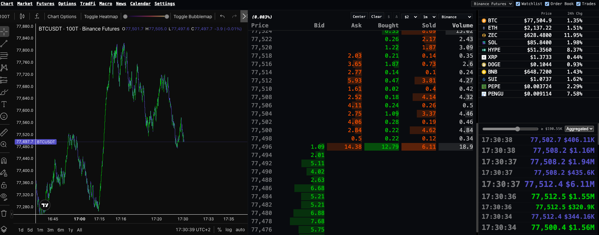
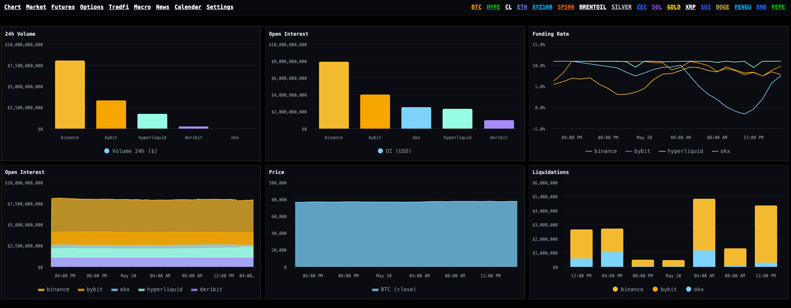
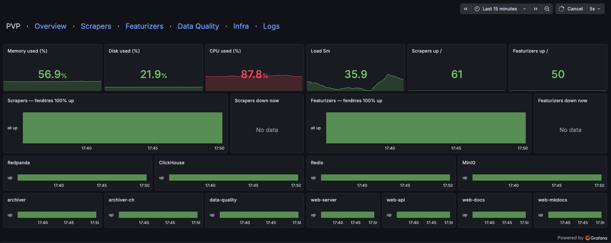

# pvp-demo

End-to-end market data infrastructure for quantitative research across crypto and synthetic equity/FX markets. Runs 24/7 on a self-hosted Proxmox server.

Screenshots only - source code and data kept private.

## Stack

- **Web app**: Python 3, FastAPI, Jinja, HTMX, TradingView Charting Library, Highcharts
- **Storage**: Delta Lake, ClickHouse, Redis, MinIO
- **Streaming**: RedPanda
- **Ingestion**: async Python scrapers (multi-exchange)
- **Featurization**: async Python pipelines
- **Data quality**: Great Expectations
- **Monitoring**: Grafana + Prometheus
- **Orchestration**: systemd
- **Config**: YAML + Pydantic
- **Docs**: MkDocs Material

## What's inside

A full pipeline ingesting market data from multiple exchanges, storing it in a lakehouse architecture, and serving it through a research web app for strategy exploration.

### Research interface

TradingView-based charting with custom tooling for strategy prototyping. For example, candles can be rendered as tick bars rather than time bars.

### Dashboards

Custom dashboards aggregating cross-market datas and derived features.

### Monitoring

Single-pane Grafana view covering ingestion lag, data quality checks, and system health.

## Why no code?

Active personal infrastructure. Happy to walk through the architecture and design decisions in an interview.

## Why these markets?

Public APIs and on-chain data offer granular microstructure (L2 books, trades, funding, oracle feeds) across crypto venues and synthetic markets like SPX perps on Hyperliquid, providing a large multi-asset research playground without institutional data subscriptions.
